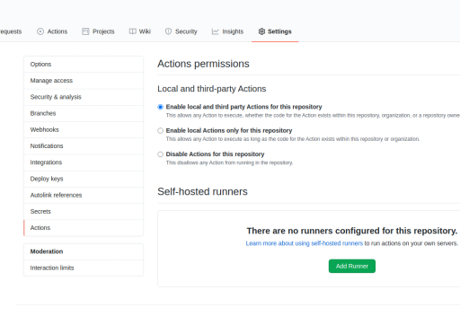

# Workflow security settings
Github actions has 3 different settings. By default, it allows all actions, including 3rd party ones. You can disable this to only allow workflows that exist in your repo. However, this comes with a caveat-- if you reuse some github inbuilt actions (e.g. `actions/checkout@v2` used [here](../.github/workflows/build.yml)) your workflow will fail. (another thing to note that if you do want to change this setting from default you have to change it per repo rather than blanket over all your repos)

These settings can be found https://github.com/[user_or_org_name]/[repo_name]/settings/actions:

