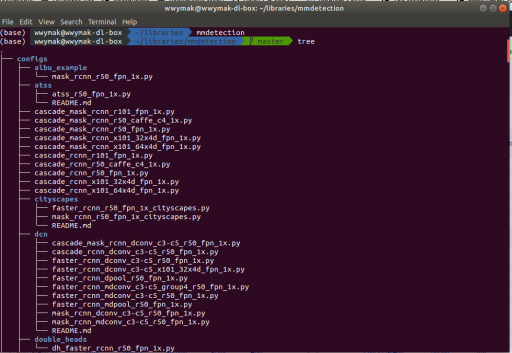

# Pretty print a directory structure for markdown

Recently I was working on some documentation and wanted to illustrate a directory structure of a repository folder.I didn't particulary want to type it all out, so I found out how to do it with [tree](http://mama.indstate.edu/users/ice/tree/) (install with `sudo apt-get install tree`)

doing `tree` at the top of the directory you want to get the structure of gives you:



Which you can copy and paste into any markdown file like so:
```
├── configs
│   ├── albu_example
│   │   └── mask_rcnn_r50_fpn_1x.py
│   ├── atss
│   │   ├── atss_r50_fpn_1x.py
│   │   └── README.md
│   ├── cascade_mask_rcnn_r101_fpn_1x.py
│   ├── cascade_mask_rcnn_r50_caffe_c4_1x.py
│   ├── cascade_mask_rcnn_r50_fpn_1x.py
│   ├── cascade_mask_rcnn_x101_32x4d_fpn_1x.py
│   ├── cascade_mask_rcnn_x101_64x4d_fpn_1x.py
```

To exclude certain directories you can use the `-I` option e.g. `tree -I '__pycache|cache|*.pyc'`
