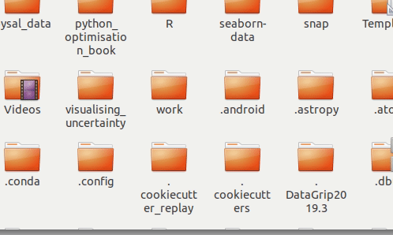
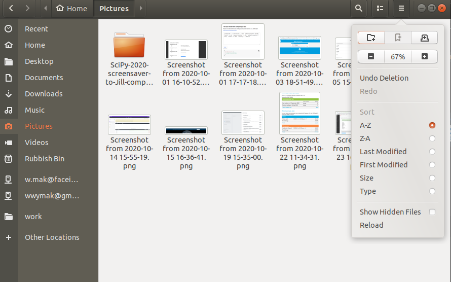

# Show hidden files in Ubuntu file manager

While the trusty `ls -al` can show me all the hidden files in the terminal, there are times when I want to view my files in the `Files` GUI. Using the keyboard shortcut `Ctrl + h` lets you do this.

Alternatively, you can use the `show hidden files` checkbox in the Files browser menu:

